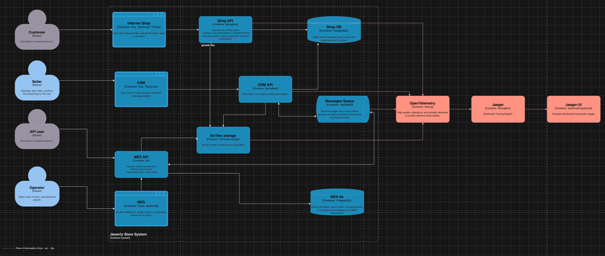

# Архитектурное решение по трейсингу

## Анализ системы
На мой взгляд важнее всего добавить трейсинг в бэкенд сервисы Shop API и в MES API. Так как клиенты напрямую взаимодействуют с этими сервисами, и им нужно уделить больше всего внимание. В этих сервисах как раз таки и осуществляется заказ ювелирных изделий и расчет стоимости. Именно поэтому, они должны идти с максимальным приоритетом. Далее пойдут все оставшиеся сервисы по необходимости.

Список данных, которые должные попасть в трейсинг:
- Идентификатор текущей операции и подзапроса. Эти параметры необходимы, для отслеживания всей цепочки запроса из сервиса к сервису.
- Время работы каждого из компонентов.
- Идентификатор пользователя, чтобы в случае необходимости можно было связаться с клиентом.
- По необходимости информация в запросах в базу данных.
- Статус/код ответов, например при успешной операции статус 200, при неудачной статус 400.
- Прочая информация, информация, которая характерна для того или иного места в системе.

## Мотивация
Внедрение трейсинга даст очень много преимуществ, перечислю самые весомые из них:
- Дает полное представление о том, как работает код в системе. То есть, после внедрения тресинга, можно увидеть полный путь от создания заказа, до его закрытия. Какие методы были вызваны, какие сервисы участвовали, время выполнения каждого компонента и тд. То есть полный пусть.
- Можно точечно оценить проблемные места в приложение, можно сказать приложение с трейсингом само будет подсвечивать долгие места, и можно будет легко определить где в системе находится узкое горлышко. И проработать это место локально, а не оценивать всю систему целиком.
- Трейсинг поможет при оценки производительности. Следить, что бы после выкатки обновления не случился даунгрейд системы. Или например, в тестировании новых подходов. Что бы, так же оценить насколько будет полезна та или иная фича, и как она повлияет в целом на производительность.
- Помощь при инцидентах/ошибках. Благодаря трейсингу, можно увидеть весь путь и понять на каком из этапах произошла ошибка и по какой причине. 

Внедрения трейсинга не является трудоемкой задачей, по сравнению если например все обкладывать логами, и с учетом преимуществ которые предоставляет трейсинг.

А теперь поговорим более конкретно, на что повлияет внедрения трейсинга с разных сторон.
Технические метрики:
- Анализ качества работы текущего, обновленного или нового функционала в системе.
- Выявления мест с узким горлышком.
- При инцидентах поможет быстрее и качественнее определить проблемное место.

Бизнесовые метрики:
- Увеличение количества успешно проведенных заказов.
- Повышение скорости ответов от технической поддержки клиентам и не только.
- Повышение стабильности системы в целом, что в свою очередь положительно скажется на клиентах и они будут с удовольствием пользоваться услугами компании.

## Предлагаемое решение
Реализовать трейсинг планируется через платформу OpenTelemetry (OTel) - это платформа наблюдения с открытым исходным кодом, которая предоставляет стандартизированный способ сбора, обработки и экспорта телеметрических данных-сигналов (метрик, трассировок и журналов) из распределённых систем.

Так же в реализации трейсинга будет использоваться Jaeger - это один из популярных инструментов трейсинга. Он помогает расследовать инциденты и выявлять узкие места в производительности микросервисной архитектуры.
Jaeger является удобным инструментом и для визуализации трассировок в распределённых системах.
Одним из компонентов Jaeger является Jaeger-UI - это веб-интерфейс для поиска и просмотров трейсов.

Итоговая схема выглядит следующим образом:
[jewerly_c4_model.drawio](jewerly_c4_model.drawio)

## Компромиссы
Теперь перейдем к стоп факторам по внедрению трейсинга в систему:
- Для внедрения трейсинга в систему требуется потратить человеческие ресурсы (человеко-часы), а так же дополнительные растраты на поддержание инфраструктуры системы трейсинга (аренда виртуалок, дисковое пространство).
- Если в система будет использовать использование внешних сервисов партнеров, то скорей всего не получиться убедить их использовать метрики в нужном формате. и в данном случае не стоит тратить свои ресурсы на эту историю.
- Если система представляет из себя легаси, или технологии на котором написанно приложение очень сильно устарели. То есть такая вероятность, что чисто технически нельзя будет добавить трейсинг. А пытаться все это связать будет не релевантно из-за огромного количества потраченного времени на разработку.

## Безопастность
Прежде всего это аунтефикация, зайти в систему могут только сотрудники, у который есть доступ, например сотрудники разработки и поддержки.
Следующим аспектом идет шифрование трафика, трафик должен идти обязательно с шифрованием. трейсинг система должна работать внутри сети организации, это идет как дополнительная степень защиты.
Трейсинг система должна работать внутри сети организации, что бы ни кто не смог просто так на него зайти.

Полный путь выглядит следующим образом:
Сотруднику необходимо сначала подключиться к внутренней сети через VPN, потом залогиниться под своей рабочей учеткой, система проверит его внутренние права/роль, и в зависимости от прав/роли предоставит информацию об трейсинге в доступных ему системах.
