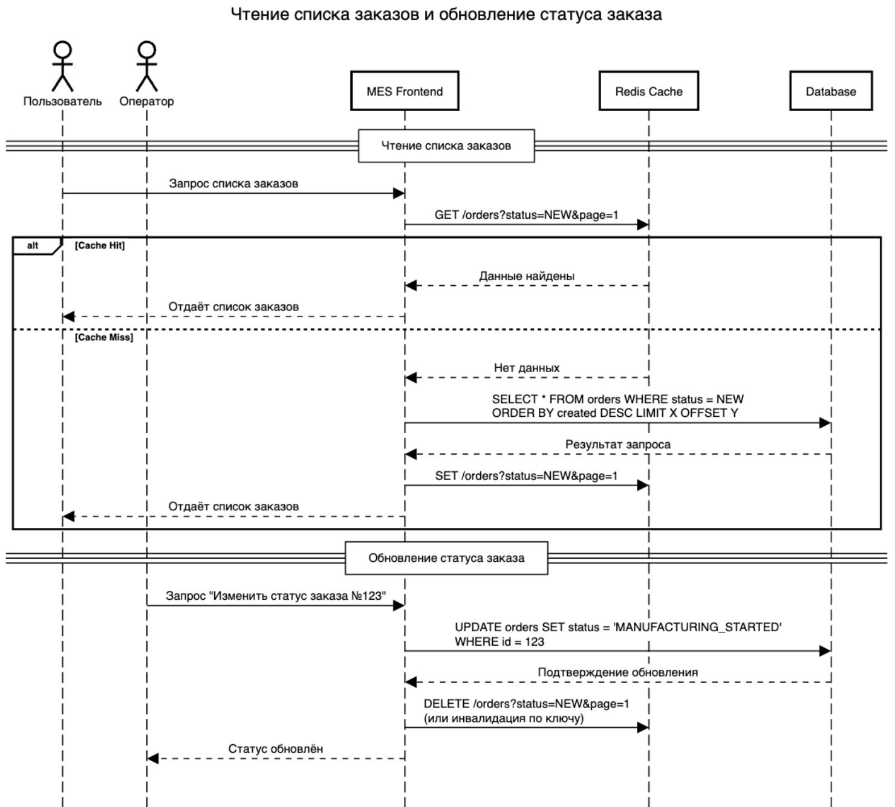

# Архитектурное решение по кешированию

## Анализ системы в контексте кеширования
Компания столкнулась с проблемой производительности в сервисе MES API. Данный сервис не справляется с потоком запросов на расчет стоимости 3D моделей. Что в свою очередь ведет к достаточно долгому расчеты. Из этого выходит, что клиенты остаются недовольны работой сервиса. Операторы жалуются на долгие загрузки страницы с заказами. Помимо всего прочего, после открытия публичного API, заказов стало еще больше, что в свою очередь привело к задержкам по заказам.

Ситуация скажем там, не очень благоприятна. Но все это можно исправить. Один из инструментов, это использовать кеширование данных. В данной ситуации, кеш может значительно разгрузить систему, тем самым скорость обработки заказов станет в разы быстрее. 

## Мотивация
Перечислю причины, почему стоит внедрить кеширование:
- Снижение задержек, при запросах к списку заказов в сервисе MES API. Сейчас операторы очень много рабочего времени тратя на ожидание загрузки по заказам, а не на решение проблем с заказами. Тем самым загрузка блокирует их непосредственную работу. Этот момент можно и нужно оптимизировать.
- Внедрение кеша уменьшит нагрузку на базу данных. Если данные будут в кеше, то системе не придется ходить в базу данных, тем самым мы освободим ресурсы на операцию записи.
- Если мы сможем закешировать стоимость уже рассчитанных 3D моделей, то при повторном запросе, система сможет моментально ответить пользователю предоставляя полную стоимость за ювелирное изделие. Такая скорость ответа очень положительно скажется на клиента, и с большой вероятность оценит сервис и придет повторено. Так же, мы сможем сэкономить на мощности железа, на котором работает MES API. Так как мы не пересчитываем уже посчитанные ювелирные изделия, а считаем только уникальные. Количество запусков на расчет 3D моделей должен значительно уменьшится. Что благоприятно скажется как для бизнеса, так и на разработчиков.

Теперь перечислим, какие проблемы решает кеширование:
- Быстрый ответ при повторном запросе (cache hit). Это происходит благодаря извлечению данных из кеша, а не из базы данных. кеш в разы быстрее отвечает по сравнению с базами данных.  
- Сокращение времени ожидания на изменение статуса заказа. Когда оператор получает заказ в работы, кеш позволит быстро открыть заказ и проработать его, далее поставить актуальный статус и закрыть свою задачу.
- Повышает отказоустойчивость системы. Так как благодаря кешу мы снимаем часть нагрузки с системы, тем самым мы освобождаем часть ресурсов железа. И, например при пиковой нагрузке от внешних клиентов через API, освобожденные ресурсы пойдут на расчет всех уникальных запросов в пиковый момент времени.

## Предлагаемое решение
В данной ситуации предлагается внедрить серверное кеширование, по нескольким причинам:
- Проблема находится на бэкенде в самом сервисе MES API. Это медленная загрузка страниц дашборда и передача больших объёмов данных из базы данных.
- Серверное кеширование, предполагает размещение дополнительного слоя между приложением и базой данных. Если бы мы, например использовали бы Redis, то данные о заказах хранились бы в оперативной памяти. Это способствует практически моментальному ответу приложения на запрос от пользователя.

Клиентское кеширование базируется на HTTP, и в данной ситуации это нам не поможет. Оно не решает проблему тяжелых операций по расчету 3D моделей на стороне бэкенд сервиса и медленному ответу от базы данных.

На мой взгляд, в данной ситуации по обработке запроса по чтению списка заказов применить паттерн кеширования под названием Cache-Aside. Логика работы его довольно-таки проста. Поступил запрос на чтение списка заказов. Сервис сначала обращается к кешу, если данные в кеше есть (cache hit), ответ берем из кеша и отправляем ответ. если данных нет (cache miss), то выполняем запрос в базу данных, далее полученный результат сохраняем в кеш и отправляем ответ на запрос.

Причины выбора паттерна Cache-Aside:
- Данный паттерн достаточно прост в реализации и в последующей поддержке
- Этот паттерн хорошо подходит для операций чтения, что как раз таки нам и нужно для решения чтения списка заказов
- Данный паттерн позволяет хранит агрегированные данные, например список заказов по разным статусам, по уникальным ключам. Это существенно ускоряет выдачу данных из кеша

Но также, у данного паттерна есть минус, это проблема в несогласованности данных. Но данная ситуация решается внедрением грамотной стратегии инвалидации кеша.

Альтернативные паттерны такие, как например Read-Through или Refresh-ahead не подойдут по следующим причинам:
- Read-Through предполагает сильную зависимость модели кеша от базы данных, а в нашем случае заказы часто изменяется, например поступил новых заказ или необходимо изменить статус заказа. И подобные ситуации будут часто приводить к кеш-промахам.
- Refresh-ahead требует сложной реализации фонового обновления кеша, дополнительного мониторинга и может привести к временной рассинхронизации, если кеш-сервис не отработает корректно. Это в свою очередь добавляет дополнительную нагрузку на команду разработки.

По стратегии инвалидации кеша предлагаю комбинированный подход:
- Временная инвалидация TTL. Для данных по заказам из дашборда, можно установить определенный срок жизни, чтобы гарантировать, что информация не слишком устарела.
- Инвалидация по ключу. При изменении статуса заказа оператором приложение автоматически удалит или обновит соответствующую запись в кеше.

Преимущества данного подхода:
- TTL позволяет в автоматическом режиме обновлять данные, тем самым риск отдачи устаревшей информации будет снижен к нулю.
- Инвалидация по ключу, позволяет моментально обновлять данные при изменениях заказа.  

Другие стратегии, такие как полностью программная инвалидация или инвалидация основанная только на запросах, окажутся менее гибкими или потребуют дополнительных усилий по реализации, что не покажется оптимальным в текущем случае.

Ниже представлен пример Sequence диаграммы последовательности действий для операций чтения списка заказов и записи об изменении статуса заказа с применением кеширования:

Сравнительный анализ стратегий инвалидации кеша в виде таблицы:

| Стратегия               | Преимущества                                                      | Ограничения                                                                          |
| ----------------------- | ----------------------------------------------------------------- | ------------------------------------------------------------------------------------ |
| Временная (TTL)         | Автоматическое обновление, снижает нагрузку, простой в реализации | Может отдавать немного устаревшие данные, если срок жизни установлен слишком большим |
| Инвалидация по ключу    | Немедленное обновление при изменении транзакционных данных        | Требует доработки в логике приложения для отслеживания изменений                     |
| Программная инвалидация | Гибкость, можно задать условия для конкретных бизнес-событий      | Повышенная сложность реализации, менее автоматизирована                              |

По итогу на мой взгляд самым оптимальным решением в нашем случае является комбинированный подход это TTL и инвалидация по ключу. Данный подход обеспечит актуальность данных без значительного увеличения сложности.
